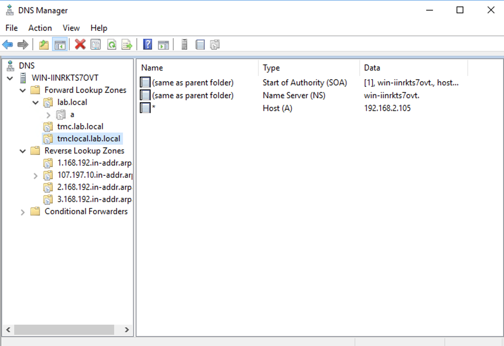

# TMC Self-Managed (local)
TMC local / Self-Managed is the on-prem version of TMC (SAS)

# Documentation
https://docs.vmware.com/en/VMware-Tanzu-Mission-Control/1.0/tanzumc-sm-install/prepare-cluster.html

#
# Step 1: 
# Create cluster in TKGs
#
```
kubectl apply -f https://github.com/ogelbric/tmclocal/raw/main/tmclocalcluster.yaml 
cluster.cluster.x-k8s.io/tmclocalcluster created
```
# Step 2:
# log onto cluster
#
```
kubectl vsphere login --server 192.168.2.100 --vsphere-username administrator@vsphere.local --tanzu-kubernetes-cluster-namespace  namespace1000 --tanzu-kubernetes-cluster-name tmclocalcluster --insecure-skip-tls-verify
```
#
# Switch context and open up cluster
#
```
kubectl config use-context tmclocalcluster
# Open up the cluster
kubectl apply -f https://github.com/ogelbric/YAML/raw/master/authorize-psp-for-gc-service-accounts.yaml
```
#
# Create install dir
#
```
mkdir harbor-install && cd $_
```
#
# Tanzu CLI + Doc for Cert manager, Contour, Harbor
#
https://docs.vmware.com/en/VMware-Tanzu-Kubernetes-Grid/2.2/using-tkg-22/install-cli.html
https://docs.vmware.com/en/VMware-Tanzu-Kubernetes-Grid/2.2/using-tkg-22/workload-packages-cni.html
#
# Tanzu Repo
#
```
tanzu package repository add tanzu-standard --url projects.registry.vmware.com/tkg/packages/standard/repo:v2.2.0 --namespace tkg-system
```
#
# List all the packages
#
```
tanzu package available list -A
```
#
# 3) Cert manager
#
# Create install dir
```
mkdir harbor-install && cd $_
```
# Add environement variables for cert manager
```
export DOMAIN=tmclocal.lab.local
export EMAIL_ADDRESS=ogelbrich@vmware.com
```
#
```
openssl genrsa -out servercakey.pem
openssl req -new -x509 -key servercakey.pem -out serverca.crt
```
# Create private key and public key
```
openssl genrsa -out server.key
openssl req -new -key server.key -out server_reqout.txt
openssl x509 -req -in server_reqout.txt -days 3650 -sha256 -CAcreateserial -CA serverca.crt -CAkey servercakey.pem -out server.crt
cp serverca.crt tls.crt
cp servercakey.pem tls.key
export tlscrt=`cat tls.crt | base64 -w 0`
export tlskey=`cat tls.key | base64 -w 0`
wget https://github.com/ogelbric/tmclocal/raw/main/clusterissuer.yaml.orig
sed "s/changetlscrt/$tlscrt/g" clusterissuer.yaml.orig | sed "s/changetlskey/$tlskey/g" > clusterissuer.yaml
# Apply the cert(s)
kubectl apply -f clusterissuer.yaml -n cert-manager
```
# Check the output
```
kubectl get clusterissuers.cert-manager.io -n cert-manager

# NAME           READY   AGE
#  local-issuer   True    3m42s
#
#
```

tanzu package available list cert-manager.tanzu.vmware.com -A
```
#  NAMESPACE   NAME                           VERSION                RELEASED-AT                    
#  tkg-system  cert-manager.tanzu.vmware.com  1.1.0+vmware.1-tkg.2   2020-11-24 13:00:00 -0500 EST  
#  tkg-system  cert-manager.tanzu.vmware.com  1.1.0+vmware.2-tkg.1   2020-11-24 13:00:00 -0500 EST  
#  tkg-system  cert-manager.tanzu.vmware.com  1.10.2+vmware.1-tkg.1  2023-01-11 07:00:00 -0500 EST  
#  tkg-system  cert-manager.tanzu.vmware.com  1.5.3+vmware.2-tkg.1   2021-08-23 13:22:51 -0400 EDT  
#  tkg-system  cert-manager.tanzu.vmware.com  1.5.3+vmware.4-tkg.1   2021-08-23 13:22:51 -0400 EDT  
#  tkg-system  cert-manager.tanzu.vmware.com  1.5.3+vmware.7-tkg.1   2021-08-23 13:22:51 -0400 EDT  
#  tkg-system  cert-manager.tanzu.vmware.com  1.5.3+vmware.7-tkg.3   2021-08-23 13:22:51 -0400 EDT  
#  tkg-system  cert-manager.tanzu.vmware.com  1.7.2+vmware.1-tkg.1   2021-10-29 08:00:00 -0400 EDT  
#  tkg-system  cert-manager.tanzu.vmware.com  1.7.2+vmware.3-tkg.1   2021-10-29 08:00:00 -0400 EDT  
#  tkg-system  cert-manager.tanzu.vmware.com  1.7.2+vmware.3-tkg.3   2021-10-29 08:00:00 -0400 EDT  
#
```
tanzu package install cert-manager --package cert-manager.tanzu.vmware.com --namespace cert-manager --version 1.10.2+vmware.1-tkg.1
tanzu package installed list -A
kubectl get apps -A
#
# 4) Contour
#
```
tanzu package available list contour.tanzu.vmware.com -A
#
#  NAMESPACE   NAME                      VERSION                RELEASED-AT                    
#  tkg-system  contour.tanzu.vmware.com  1.23.5+vmware.1-tkg.1  2023-04-04 20:00:00 -0400 EDT  
# contour-data-values file can be obtained with below command
tanzu package available get contour.tanzu.vmware.com/1.23.5+vmware.1-tkg.1 --default-values-file-output contour-data-values.yaml
# or use this file
cat << EOF > contour-data-values.yaml
---
infrastructure_provider: vsphere
namespace: tanzu-system-ingress
contour:
 configFileContents: {}
 useProxyProtocol: false
 replicas: 2
 pspNames: "vmware-system-restricted"
 logLevel: info
envoy:
 service:
   type: LoadBalancer
   annotations: {}
   nodePorts:
     http: null
     https: null
   externalTrafficPolicy: Cluster
   disableWait: false
 hostPorts:
   enable: true
   http: 80
   https: 443
 hostNetwork: false
 terminationGracePeriodSeconds: 300
 logLevel: info
 pspNames: null
certificates:
 duration: 8760h
 renewBefore: 360h
EOF
#
kubectl create clusterrolebinding envoy-tkg-admin-privileged-binding --clusterrole=psp:vmware-system-privileged --serviceaccount=tanzu-system-ingress:envoy
# Remove comments
yq -i eval '... comments=""' contour-data-values.yaml
#
#
tanzu package install contour \
--package contour.tanzu.vmware.com \
--version 1.23.5+vmware.1-tkg.1 \
--values-file contour-data-values.yaml \
--namespace projectcontour
#
tanzu package installed list -A
#
kubectl get apps -A
#
get pods -A | grep contour
#
# default                        my-release-contour-contour-certgen-nb995                             0/1     Completed   0               6d
# tanzu-system-ingress           contour-747dbc88b8-29bf5                                             1/1     Running     0               4m49s
# tanzu-system-ingress           contour-747dbc88b8-hl5d2                                             1/1     Running     0               4m49s

# Get the IP
kubectl get svc --namespace tanzu-system-ingress  -w
# Update DNS with IP
# Add a new subdomain tmclocal.lab.local and apply star A record to the above found IP.
```


#
# 5) Install Harbor
#
```
tanzu package installed list -A

tanzu package available list harbor.tanzu.vmware.com -A
#
#  NAMESPACE   NAME                     VERSION               RELEASED-AT                    
#  tkg-system  harbor.tanzu.vmware.com  2.2.3+vmware.1-tkg.1  2021-07-07 14:00:00 -0400 EDT  
#  tkg-system  harbor.tanzu.vmware.com  2.2.3+vmware.1-tkg.2  2021-07-07 14:00:00 -0400 EDT  
#  tkg-system  harbor.tanzu.vmware.com  2.3.3+vmware.1-tkg.1  2021-09-28 02:05:00 -0400 EDT  
#  tkg-system  harbor.tanzu.vmware.com  2.5.3+vmware.1-tkg.1  2021-09-28 02:05:00 -0400 EDT  
#  tkg-system  harbor.tanzu.vmware.com  2.7.1+vmware.1-tkg.1  2021-09-28 02:05:00 -0400 EDT  
#
# note + changes to _
imgpkg pull -b projects.registry.vmware.com/tkg/packages/standard/harbor:v2.7.1_vmware.1-tkg.1 -o /tmp/harbor-package-v2.7.1_vmware.1-tkg.1
#

cp /tmp/harbor-package-v2.7.1_vmware.1-tkg.1/config/values.yaml harbor-data-values.yaml
wget https://github.com/mikefarah/yq/releases/latest/download/yq_linux_amd64 -O /usr/bin/yq && chmod +x /usr/bin/yq

bash /tmp/harbor-package-v2.7.1_vmware.1-tkg.1/config/scripts/generate-passwords.sh harbor-data-values.yaml
sed -i 's/hostname: harbor.yourdomain.com/hostname: registry.tmclocal.lab.local/g' harbor-data-values.yam
SE=$(kubectl get sc | grep def | awk '{ print $1 }')
sed -i "s/storageClass: \"\"/storageClass: \"$SE\"/g" harbor-data-values.yaml
yq -i eval '... comments=""' harbor-data-values.yaml

tanzu package install harbor \
--package harbor.tanzu.vmware.com \
--version 2.7.1+vmware.1-tkg.1 \
--values-file harbor-data-values.yaml \
--namespace harbor
#
tanzu package installed list -A
tanzu package installed get harbor --namespace harbor
kubectl get apps -A
kubectl get pods -n tanzu-system-registry
#
# Makre sure POD(s) are up
#
watch kubectl get pods -n tanzu-system-registry
#
# Look at the requested certs
#
harbor-install]# kubectl -n tanzu-system-registry  get certificate
#
kubectl -n tanzu-system-registry get secret harbor-tls -o=jsonpath="{.data.ca\.crt}" | base64 -d
k get proxy -A
# NAMESPACE               NAME                      FQDN                                 TLS SECRET   STATUS   STATUS DESCRIPTION
# tanzu-system-registry   harbor-httpproxy          registry.tmclocal.lab.local          harbor-tls   valid    Valid HTTPProxy
# tanzu-system-registry   harbor-httpproxy-notary   notary.registry.tmclocal.lab.local   harbor-tls   valid    Valid HTTPProxy
#
# admin Password
grep -i harborAdminPassword harbor-data-values.yaml | awk '{ print $2 }'
# lpJUUAJRG4xE6XyK

```

#
# Deploy TMC local repo items
#
```
# Download link
https://customerconnect.vmware.com/en/downloads/info/slug/infrastructure_operations_management/vmware_tanzu_mission_control_self_managed/1_0_0
# Move from Windoes to Linux box
pscp .\tmc-self-managed-1.0.0.tar root@192.168.1.5:/root/harbor-install/.
```


#
# Deploy TMC local
#
```
mkdir tanzumc
tar -xf tmc-self-managed-1.0.0.tar -C ./tanzumc  

```


# Randon Trouble shooting items
# Delete cert manager
helm del  cert-manager
helm del  harbor -n harbor
# List bitnami repo
helm search repo bitnami 
helm del harbor -n harbor
helm del ingress -n projectcontour  
helm del cert-manager -n cert-manager

tanzu package available     list
tanzu package installed delete harbor --namespace harbor


# More Random Notes
mkdir harbor-install && cd $_

kubectl create namespace projectcontour
# I for some reason on this server did not have Helm
curl -fsSL -o get_helm.sh https://raw.githubusercontent.com/helm/helm/main/scripts/get-helm-3
chmod 700 get_helm.sh
./get_helm.sh
# Open up the cluster
kubectl apply -f https://github.com/ogelbric/YAML/raw/master/authorize-psp-for-gc-service-accounts.yaml
#
helm repo add bitnami https://charts.bitnami.com/bitnami
helm repo update
helm install ingress bitnami/contour -n projectcontour
# Watch in a different window
watch kubectl get pods -n projectcontour


kubectl create namespace projectcontour
# I for some reason on this server did not have Helm
curl -fsSL -o get_helm.sh https://raw.githubusercontent.com/helm/helm/main/scripts/get-helm-3
chmod 700 get_helm.sh
./get_helm.sh
# Open up the cluster
kubectl apply -f https://github.com/ogelbric/YAML/raw/master/authorize-psp-for-gc-service-accounts.yaml
#
helm repo add bitnami https://charts.bitnami.com/bitnami
helm repo update
helm install ingress bitnami/contour -n projectcontour
# Watch in a different window
watch kubectl get pods -n projectcontour
# Get the IP
kubectl get svc ingress-contour-envoy --namespace projectcontour -w
kubectl describe svc ingress-contour-envoy --namespace projectcontour | grep Ingress | awk '{print $3}'
# Update DNS with IP
# Add a new subdomain tmclocal.lab.local and apply star A record to the above found IP.
```

```
# Add environement variables for cert manager
export DOMAIN=tmclocal.lab.local
export EMAIL_ADDRESS=ogelbrich@vmware.com
#
kubectl create namespace cert-manager
helm search repo bitnami | grep cert
helm install cert-manager bitnami/cert-manager --namespace cert-manager  --set installCRDs=true
# Make sure they are running
watch kubectl get pods -n cert-manager
# Generate Certs
# Generate CA files (.crt and .pem)
openssl genrsa -out servercakey.pem
openssl req -new -x509 -key servercakey.pem -out serverca.crt
# Create private key and public key
openssl genrsa -out server.key
openssl req -new -key server.key -out server_reqout.txt
openssl x509 -req -in server_reqout.txt -days 3650 -sha256 -CAcreateserial -CA serverca.crt -CAkey servercakey.pem -out server.crt
cp serverca.crt tls.crt
cp servercakey.pem tls.key
export tlscrt=`cat tls.crt | base64 -w 0`
export tlskey=`cat tls.key | base64 -w 0`
wget https://github.com/ogelbric/tmclocal/raw/main/clusterissuer.yaml.orig
sed "s/changetlscrt/$tlscrt/g" clusterissuer.yaml.orig | sed "s/changetlskey/$tlskey/g" > clusterissuer.yaml
# Apply the cert(s)
kubectl apply -f clusterissuer.yaml -n cert-manager
# Check the output
kubectl get clusterissuers.cert-manager.io -n cert-manager
# NAME           READY   AGE
#  local-issuer   True    3m42s
#
# Install Harbor in a POD
kubectl create namespace harbor
# Create harbor values file
cat << EOF > harbor-values.yaml
harborAdminPassword: Password12345

service:
  type: Ingress
  tls:
    enabled: true
    existingSecret: harbor-tls-staging
    notaryExistingSecret: notary-tls-staging

ingress:
  enabled: true
  hosts:
    core: registry.$DOMAIN
    notary: notary.$DOMAIN
  annotations:
    cert-manager.io/cluster-issuer: local-issuer         # use llocal-issuer as the cluster issuer for TLS certs
    ingress.kubernetes.io/force-ssl-redirect: "true"     # force https, even if http is requested
    kubernetes.io/ingress.class: contour                 # using Contour for ingress
    kubernetes.io/tls-acme: "true"                       # using ACME certificates for TLS
externalURL: https://registry.$DOMAIN

portal:
  tls:
    existingSecret: harbor-tls-staging
EOF
#
# Install Harbor
#
helm install harbor bitnami/harbor -f ./harbor-values.yaml -n harbor
#
# Makre sure POD(s) are up
#
watch kubectl get pods -n harbor
#
# Look at the requested certs
#
kubectl -n harbor get certificate
#

# some how the above harbor values file does not generate in my environment the proper ingress service and I had to edit it by hand
# with below output
#
k edit ingress harbor-ingress  -n harbor
k edit ingress harbor-ingress-notary  -n harbor
kubectl get ingress -A
# harbor      harbor-ingress          <none>   registry.tmclocal.lab.local   192.168.2.105   80, 443   21h
# harbor      harbor-ingress-notary   <none>   notary.tmclocal.lab.local     192.168.2.105   80, 443   21h
#
k get svc -A | grep ingress
# projectcontour      ingress-contour                   ClusterIP      198.48.119.233   <none>          8001/TCP                     5d
# projectcontour      ingress-contour-envoy             LoadBalancer   198.63.142.20    192.168.2.105   80:30106/TCP,443:31682/TCP   5d
